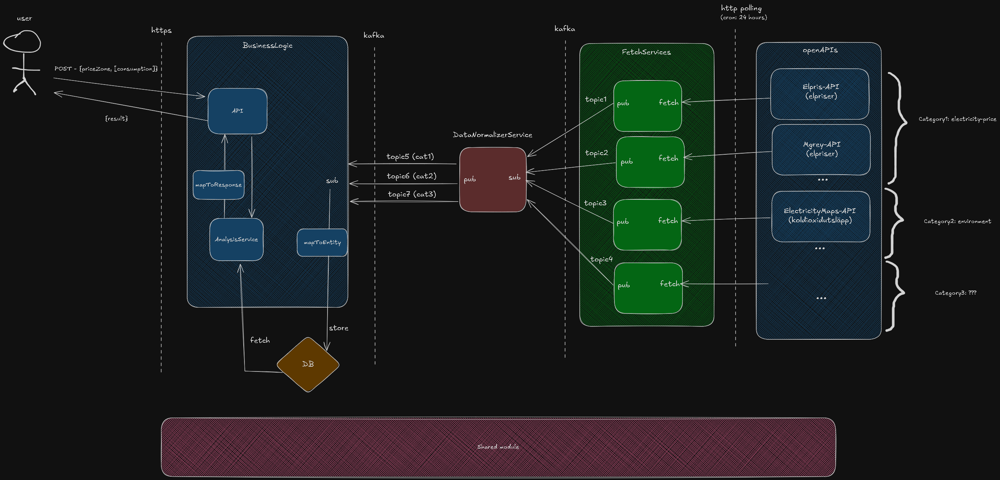

## Elpotimeraren

Elpotimeraren aims to be a solution that helps households and businesses lower their electricity costs and reduce their environmental impact by using electricity more efficiently. It does this by leveraging open and free APIs. The goal is to provide a foundation for further discussion in a technical case.

## Architecture
Below we have a sketch of what is implemented thusfar in this project.


### Open APIs
APIs that are free and open for the public to use. In this case we are interested in APIs that provide us with data relevant for electricity consumption optimization.

### Fetch Services
Each fetch-service is dedicated to one open API and its sole role is to gather from its assigned API through http-polling. Each fetch-service is scheduled to run a fetch-job every 24 hours and upon receiving fetched data, publish it to its dedicated kafka-topic.

### DataNormalizerService
Normalizer service that consumes from fetch-services topics, normalizes said data, and publishes normalized-data to dedicated "normalized" topics.
In this scenario, normalizing data means that we map the received data to a standardized format. The normalizer service consumes from the following topics:
- electricity.price.elpris.feed
- electricity.price.mgrey.feed
- emissions.electricity.maps.feed

The normalized data is published to the following topics:
- electricity.price.normalized.feed (mapped from elpris and mgrey topic data)
- emissions.normalized.feed (mapped from electricity-maps topic data)

### Business Logic
Business Logic Service that does the following: 
- Consumes from normalized topics
- Maps and saves normalized data in a psql database (substituted with a h2 in mem. DB for this demo)
- Provides an API for user interaction that analyzes electricity consumption data to deliver a breakdown of costs and CO2 emissions. It also highlights the times of day when electricity usage was most expensive and when it generated the highest emissions.

### Shared module
For code that is shared amongst several modules.

## How to start
- Start Docker daemon 
- cd to /kafka folder and run "docker-compose up -d" to run kafka on docker.
- Start the following modules: business-logic, datanormalizer, fetch-electricitymaps, fetch-elpris, fetch-mgrey

## Exmaple usage
User sends POST request to "/api/optimize" endpoint with example body (note: timestamps should overlap with the startDates of the data that has been saved):

```json
{
  "consumption": [
    { "timeStart": "2025-04-20T22:00:00+00:00", "timeEnd": "2025-04-19T23:00:00+00:00", "kiloWatt": 1.0 },
    { "timeStart": "2025-04-20T23:00:00+00:00", "timeEnd": "2025-04-20T00:00:00+00:00", "kiloWatt": 1.1 },
    { "timeStart": "2025-04-21T00:00:00+00:00", "timeEnd": "2025-04-20T01:00:00+00:00", "kiloWatt": 1.2 },    
    ...
    { "timeStart": "2025-04-21T22:00:00+00:00", "timeEnd": "2025-04-20T23:00:00+00:00", "kiloWatt": 1.4 }
  ],
  "priceZone": "SE3"
}
```

Exmaple response:
```json
{
    "priceZone": "SE3",
    "aggregationPeriod": "hourly",
    "mostExpensiveDataPoint": {
        "timeStart": "2025-04-21T17:00:00Z",
        "timeEnd": "2025-04-20T18:00:00Z",
        "costSek": 0.628271,
        "costEur": 0.05691699999999999,
        "carbonEmissionGrams": 25.2,
        "kiloWatt": 1.4,
        "background": {
            "sekPerKWh": 0.448765,
            "eurPerKWh": 0.040655,
            "carbonEmissionGramsPerKWh": 18
        }
    },
    "highestEmissionDataPoint": {
        "timeStart": "2025-04-21T12:00:00Z",
        "timeEnd": "2025-04-20T13:00:00Z",
        "costSek": 0.17548299999999997,
        "costEur": 0.015861999999999998,
        "carbonEmissionGrams": 29.4,
        "kiloWatt": 1.4,
        "background": {
            "sekPerKWh": 0.12534499999999998,
            "eurPerKWh": 0.01133,
            "carbonEmissionGramsPerKWh": 21
        }
    },
    "dataPoints": [
        {
            "timeStart": "2025-04-20T22:00:00Z",
            "timeEnd": "2025-04-19T23:00:00Z",
            "costSek": 0.3381,
            "costEur": 0.03086,
            "carbonEmissionGrams": 17.0,
            "kiloWatt": 1.0,
            "background": {
                "sekPerKWh": 0.3381,
                "eurPerKWh": 0.03086,
                "carbonEmissionGramsPerKWh": 17
            }
        },
        {
            "timeStart": "2025-04-20T23:00:00Z",
            "timeEnd": "2025-04-20T00:00:00Z",
            "costSek": 0.35888600000000004,
            "costEur": 0.032758,
            "carbonEmissionGrams": 18.700000000000003,
            "kiloWatt": 1.1,
            "background": {
                "sekPerKWh": 0.32626,
                "eurPerKWh": 0.02978,
                "carbonEmissionGramsPerKWh": 17
            }
        },
      ...
        {
            "timeStart": "2025-04-21T22:00:00Z",
            "timeEnd": "2025-04-20T23:00:00Z",
            "costSek": 0.47068,
            "costEur": 0.04214,
            "carbonEmissionGrams": null,
            "kiloWatt": 1.4,
            "background": {
                "sekPerKWh": 0.3362,
                "eurPerKWh": 0.0301,
                "carbonEmissionGramsPerKWh": null
            }
        }
    ]
}
```

### Tip for when running locally for testing
If running locally for testing purposes one should change the CRON-job from running every 24-hours at midnight
```java
@Scheduled(cron = "0 0 0 * * ?")
```
to something that runs more frequently, like every 2 minutes:

```java
@Scheduled(fixedRate = 1000*120)
```
